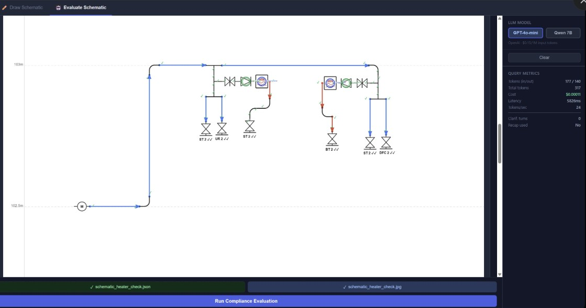
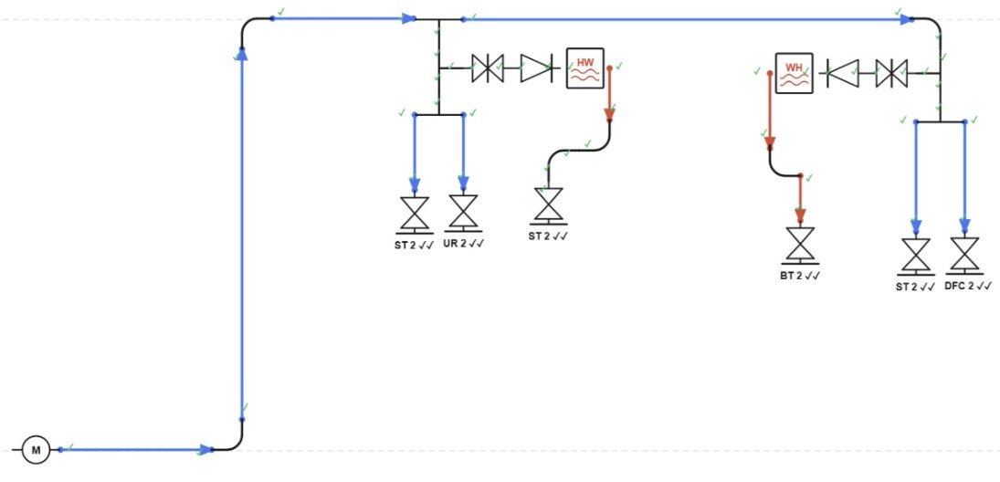
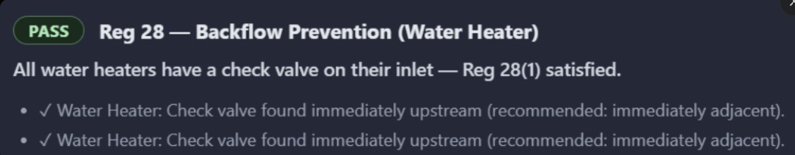
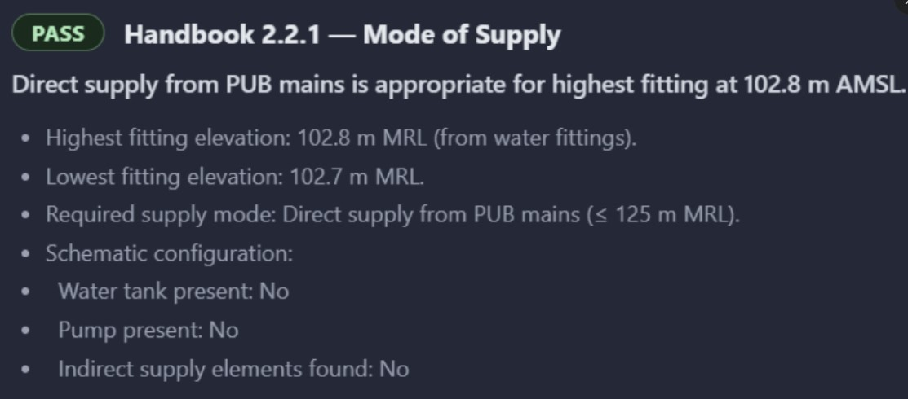
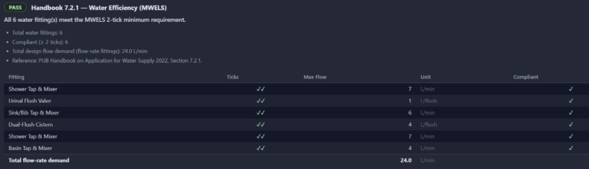
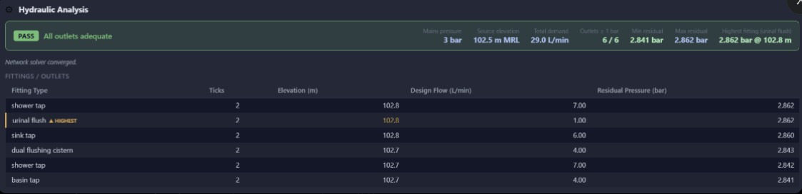

# Schematic Drawing Portal

An interactive web application for designing water pipe schematics and running AI-powered compliance evaluations against Singapore's PUB water supply regulations.



---

## What it does

**Stage 1 — Draw:** Design water pipe schematics on a real-world elevation (mRL) canvas using drag-and-drop symbols. Export structured JSON metadata for downstream processing.

**Stage 2 — Evaluate:** Submit your schematic for AI-driven compliance checking. The system parses the schematic JSON, runs deterministic rule checks (Reg 28, HB 2.2.1, HB 7.2.1) and a full hydraulic pressure analysis, then explains the results in plain English using GPT-4o-mini or Qwen 2.5-72B via a RAG pipeline grounded in the official PUB regulations and handbook.

---

## Key Features

| Feature | Description |
|---|---|
| Drawing Canvas | Drag-and-drop schematic editor with 16 built-in water system symbols |
| Real-world Elevation | Y-axis maps directly to mRL (metres above sea level) |
| AI Compliance Evaluation | Checks Reg 28 (backflow prevention), HB 2.2.1 (mode of supply), HB 7.2.1 (WELS water efficiency) |
| Hydraulic Analysis | Network solver computes residual pressure at every outlet under simultaneous peak demand |
| RAG Knowledge Base | Retrieval-augmented Q&A over PUB Handbook 2022 and Public Utilities Regulations |
| Dual LLM Support | Switch between OpenAI GPT-4o-mini and Together AI Qwen2.5-72B |
| Token Metrics | Live per-query cost, latency, and token tracking |
| Symbol Manager | Upload custom SVG/PNG symbols alongside built-in defaults |
| Docker Ready | Full multi-stage Docker build for both development (hot reload) and production (Nginx) |

---

## Screenshots

### Drawing Canvas


### Evaluate Schematic Tab


### AI Compliance Report — Reg 28 (Backflow Prevention)


### AI Compliance Report — HB 2.2.1 (Mode of Supply)


### AI Compliance Report — HB 7.2.1 (WELS Water Efficiency)


### Hydraulic Analysis


---

## Quick Start (Docker)

### Prerequisites
- [Docker Desktop](https://www.docker.com/products/docker-desktop/) installed and running
- OpenAI API key ([get one here](https://platform.openai.com/api-keys))
- Together AI API key ([free tier available](https://api.together.xyz)) — required for Qwen model

### 1. Clone the repo

```bash
git clone https://github.com/your-username/schematic-drawing-portal.git
cd schematic-drawing-portal
```

### 2. Set up API keys

```bash
cp backend/.env.example backend/.env
# Edit backend/.env and fill in your OPENAI_API_KEY and TOGETHER_API_KEY
```

### 3. Run (development — hot reload)

```bash
docker-compose up --build

# Frontend (Vite dev server):  http://localhost:5173
# Backend API:                 http://localhost:8000
# API docs (Swagger):          http://localhost:8000/docs
```

### 4. Run (production build)

```bash
docker-compose -f docker-compose.yml up --build

# Frontend (Nginx):  http://localhost:3000
# Backend API:       http://localhost:8000
```

---

## Environment Variables

### Backend (`backend/.env`)

| Variable | Required | Description |
|---|---|---|
| `OPENAI_API_KEY` | Yes (for GPT-4o-mini) | OpenAI API key |
| `TOGETHER_API_KEY` | Yes (for Qwen 2.5-72B) | Together AI API key |
| `SYMBOLS_PATH` | No (default: `/app/symbols`) | Path to symbols directory inside container |
| `ALLOWED_ORIGINS` | No | Comma-separated CORS origins |

### Frontend (build-time)

| Variable | Default | Description |
|---|---|---|
| `VITE_API_BASE_URL` | `http://localhost:8000` | Backend API base URL |

> **Security:** Never commit `backend/.env` to version control. It is listed in `.gitignore`. Use the provided `backend/.env.example` as a template.

---

## Stage 1: Drawing Canvas

### mRL Configuration
- Set **Upper mRL** (max 170 m) and **Lower mRL** (min 90 m) in the right panel
- The canvas Y-axis maps to real-world elevation; the grid updates live

### Placing Symbols
- **Drag** any symbol from the palette onto the canvas
- Click a placed symbol to select it (dashed blue border)
- Drag to reposition; right-click for context options

### Drawing Pipes
1. Click **Water Pipe** in the palette to activate pipe drawing mode (header turns blue)
2. Click on canvas to set the start point
3. Click again to complete the segment — a dashed preview follows your cursor
4. Pipes chain automatically; press **Escape** to exit pipe mode

### Export Metadata
Click **Export Metadata (JSON)** to download a structured JSON file with all symbol positions, mRL elevations, and pipe segments. See [example exports](docs/examples/).

### Symbol Manager
- Click **Manage Symbols** to open the manager
- Upload custom SVG/PNG symbols (max 2 MB)
- Double-click a custom symbol name to rename
- Delete custom symbols (built-in defaults are protected)

---

## Stage 2: AI Compliance Evaluation

### How to use
1. Draw your schematic in the **Draw Schematic** tab
2. Switch to the **Evaluate Schematic** tab
3. Select your LLM model (GPT-4o-mini or Qwen 7B)
4. Click **Run Compliance Evaluation**

The system exports the schematic JSON automatically, sends it to the backend, and streams back the evaluation report.

### Compliance Checks

| Check | Regulation | What it verifies |
|---|---|---|
| Reg 28 — Backflow Prevention | Public Utilities (Water Supply) Regulations, Reg 28(1) | Every water heater has a check valve immediately upstream |
| HB 2.2.1 — Mode of Supply | PUB Handbook 2022, Section 2.2.1 | Direct supply from PUB mains is appropriate given highest fitting elevation (≤ 125 m MRL) |
| HB 7.2.1 — Water Efficiency | PUB Handbook 2022, Section 7.2.1 | All water fittings carry a MWELS ≥ 2-tick rating |

### Hydraulic Analysis

The backend runs a network pressure solver across all fittings simultaneously:
- Inputs: mains pressure (3 bar default), source elevation, pipe network topology from schematic JSON
- Outputs: residual pressure (bar) at every outlet under peak simultaneous demand
- Flags the **highest elevation fitting** (worst-case pressure point)
- Pass/Fail: all outlets must have ≥ 1 bar residual pressure

### RAG Knowledge Base
The AI explanations are grounded in two official documents loaded into a ChromaDB vector store:
- *PUB Handbook on Application for Water Supply 2022*
- *Public Utilities (Water Supply) Regulations*

The backend ingests these on startup. To use a custom document set, drop PDF or DOCX files into `backend/knowledge/` and restart the container.

---

## Project Structure

```
schematic-drawing-portal/
├── .gitignore
├── .env.example                      # Root env template
├── docker-compose.yml                # Production orchestration
├── docker-compose.override.yml       # Dev hot-reload overrides
├── README.md
├── start.sh / stop.sh                # Convenience scripts
│
├── backend/
│   ├── .env.example                  # API key template — copy to .env
│   ├── Dockerfile                    # Production image (Python 3.12-slim)
│   ├── Dockerfile.dev                # Dev image with --reload
│   ├── requirements.txt              # Python dependencies
│   └── app/
│       ├── main.py                   # FastAPI entry point
│       ├── config.py                 # Settings & environment
│       ├── agents/                   # LLM agents (compliance, hydraulic, RAG, chat)
│       ├── routers/                  # API endpoints (evaluate, chat, symbols, health)
│       ├── models/                   # Pydantic data models
│       ├── schemas/                  # Request/response schemas
│       └── services/                 # Business logic (vector store, metrics, symbols)
│   └── symbols/
│       ├── default/                  # 16 built-in SVG water system symbols
│       ├── custom/                   # User-uploaded symbols (gitignored)
│       └── manifest.json             # Symbol registry
│   └── knowledge/                    # Regulatory PDFs for RAG (gitignored)
│
├── frontend/
│   ├── Dockerfile                    # Production (Node 20 → Nginx multi-stage)
│   ├── Dockerfile.dev                # Dev (Vite dev server)
│   ├── nginx.conf                    # Nginx reverse proxy config
│   ├── package.json
│   ├── vite.config.ts
│   └── src/
│       ├── components/
│       │   ├── canvas/               # Drawing canvas & pipe tools
│       │   ├── chat/                 # Evaluation report & chat UI
│       │   ├── panel/                # Symbol palette & settings panels
│       │   └── layout/              # App shell
│       ├── store/                    # Zustand state (canvas, chat, UI)
│       ├── hooks/                    # Custom React hooks
│       ├── types/                    # TypeScript type definitions
│       └── utils/                    # Geometry, mRL mapping, metadata builder
│
├── k8s/                              # Kubernetes manifests
│   ├── namespace.yaml
│   ├── storage/                      # PersistentVolumeClaim for symbols
│   ├── backend/                      # Deployment, Service, ConfigMap
│   └── frontend/                     # Deployment, Service, ConfigMap
│
└── docs/
    ├── screenshots/                  # UI screenshots
    └── examples/                     # Example exported schematic JSON files
```

---

## Default Symbols

| Symbol | Type |
|---|---|
| Water Pipe | Line drawing tool |
| Gate Valve | Drag-drop |
| Check Valve (NRV) | Drag-drop |
| Pump | Drag-drop |
| Flow Meter | Drag-drop |
| Tee Junction | Drag-drop |
| Elbow / Bend | Drag-drop |
| Reducer | Drag-drop |
| Water Heater | Drag-drop |
| Water Tank | Drag-drop |
| Water Meter | Drag-drop |
| Water Fittings | Drag-drop |
| Fire Hydrant | Drag-drop |
| Sump / Manhole | Drag-drop |
| Hot Water Pipe | Line drawing tool |
| Cold Water Pipe | Line drawing tool |

---

## Metadata Export Format

```json
{
  "schema_version": "1.0",
  "exported_at": "2026-04-01T10:30:00.000Z",
  "mrl_config": { "upper_mrl": 103, "lower_mrl": 102.5, "unit": "m", "range": 0.5 },
  "canvas": { "width_px": 1200, "height_px": 800 },
  "elements": [
    {
      "id": "el_uuid",
      "type": "symbol",
      "symbol_id": "water_heater",
      "symbol_name": "Water Heater",
      "position": { "canvas_x": 680, "canvas_y": 210 },
      "mrl": { "value": 102.8, "unit": "m" },
      "rotation_deg": 0,
      "fittings": [
        { "type": "shower_tap", "ticks": 2, "flow_rate": 7 }
      ]
    }
  ],
  "pipes": [
    {
      "id": "pipe_uuid",
      "type": "cold_water_pipe",
      "start": { "canvas_x": 100, "canvas_y": 165, "mrl": 103.0 },
      "end": { "canvas_x": 540, "canvas_y": 165, "mrl": 103.0 },
      "length_px": 440,
      "rotation_deg": 0
    }
  ],
  "summary": { "total_elements": 8, "total_pipes": 12, "total_pipe_length_px": 3240 }
}
```

See [docs/examples/](docs/examples/) for real exported schematics.

---

## Kubernetes Deployment

Manifests are in `k8s/`. Apply in order:

```bash
kubectl apply -f k8s/namespace.yaml
kubectl apply -f k8s/storage/
kubectl apply -f k8s/backend/
kubectl apply -f k8s/frontend/
```

> **Note:** The backend uses a `ReadWriteOnce` PVC for symbol storage. For multi-replica scaling, replace the PVC with a shared object store (S3/MinIO) and update `SYMBOLS_PATH` accordingly.

---

## Tech Stack

| Layer | Technology |
|---|---|
| Frontend | React 18, TypeScript, Vite, Konva.js (canvas), Zustand (state), Axios |
| Backend | Python 3.12, FastAPI, Uvicorn |
| AI / LLM | OpenAI GPT-4o-mini, Together AI Qwen2.5-72B |
| RAG | ChromaDB, LangChain document loaders |
| Containerisation | Docker, Docker Compose, Nginx |
| Orchestration (optional) | Kubernetes |

---

## mRL Constraints

| Setting | Hard Limit |
|---|---|
| Lower mRL | Minimum **90 m** |
| Upper mRL | Maximum **170 m** |
| Range | At least **1 m** spread required |

---

## Contributing

Pull requests are welcome. For major changes, open an issue first to discuss what you'd like to change.

---

## License

MIT
